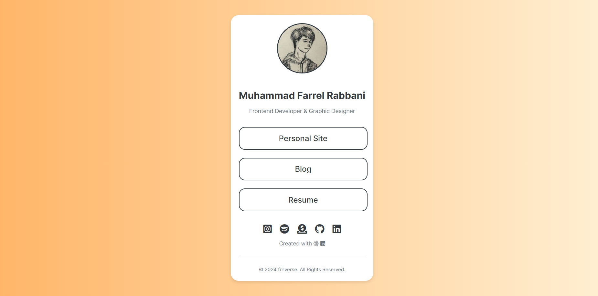

# Simple React Links Website 🔗

This is a simple and modern links website built with React. It allows you to create a personal page where you can list all your important links in one place.

## Features

- Responsive design
- Modern UI with gradient background
- Profile picture and bio section
- Customizable link buttons
- Social media icons with hover effects
- Easy to customize

## Demo

You can check out the live demo of the links website [here](https://links.frl.blue).

## License

This project is licensed under the MIT License - see the [LICENSE](LICENSE) file for details.

## Acknowledgements

- [React](https://reactjs.org/)
- [Font Awesome](https://fontawesome.com/)
- [Create React App](https://create-react-app.dev/)
- [Tailwind](https://tailwindcss.com)
- [Vercel](https://vercel.com/)

## Contact

If you have any questions or feedback, feel free to contact me at [prozycal@gmail.com](mailto:prozycal@gmail.com).

---

Enjoy your own links website! 🎉
